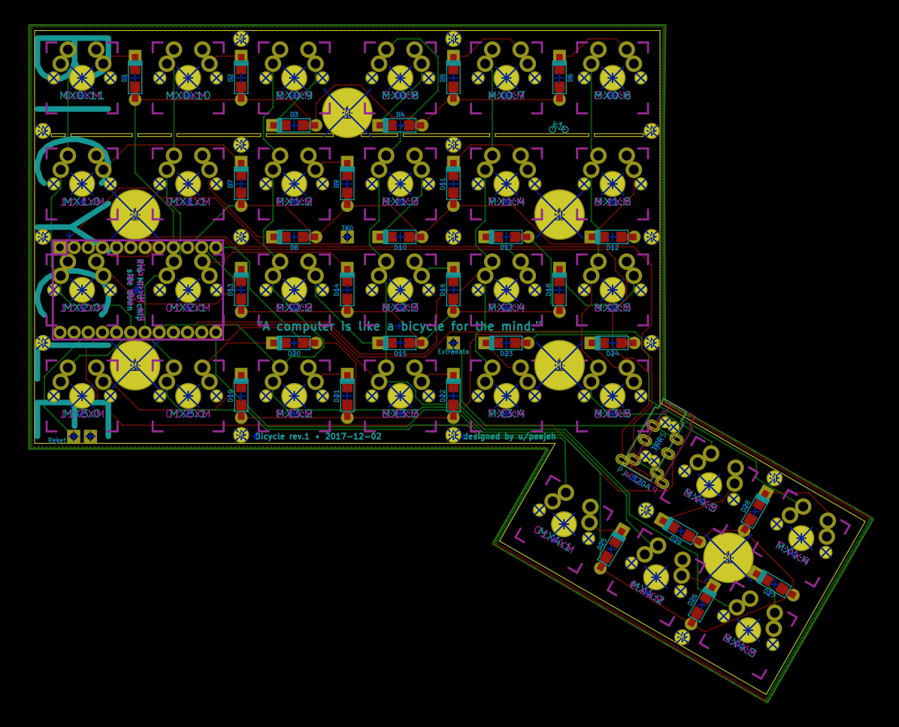
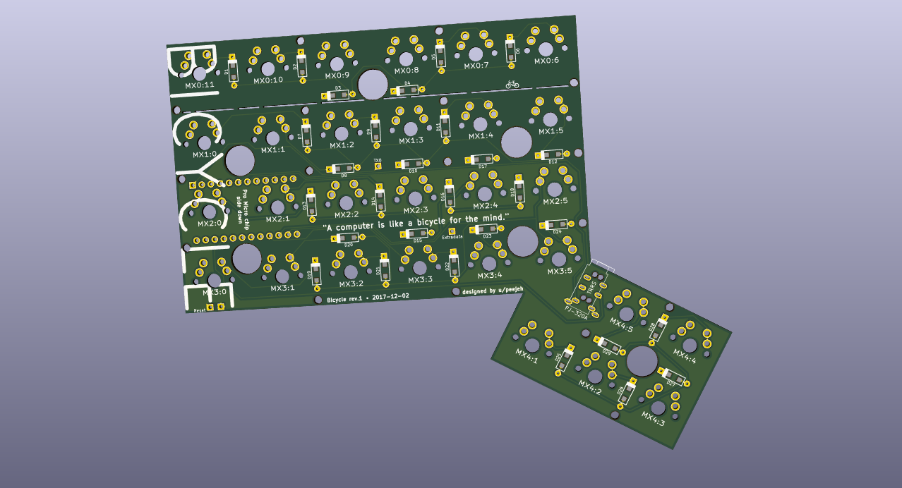
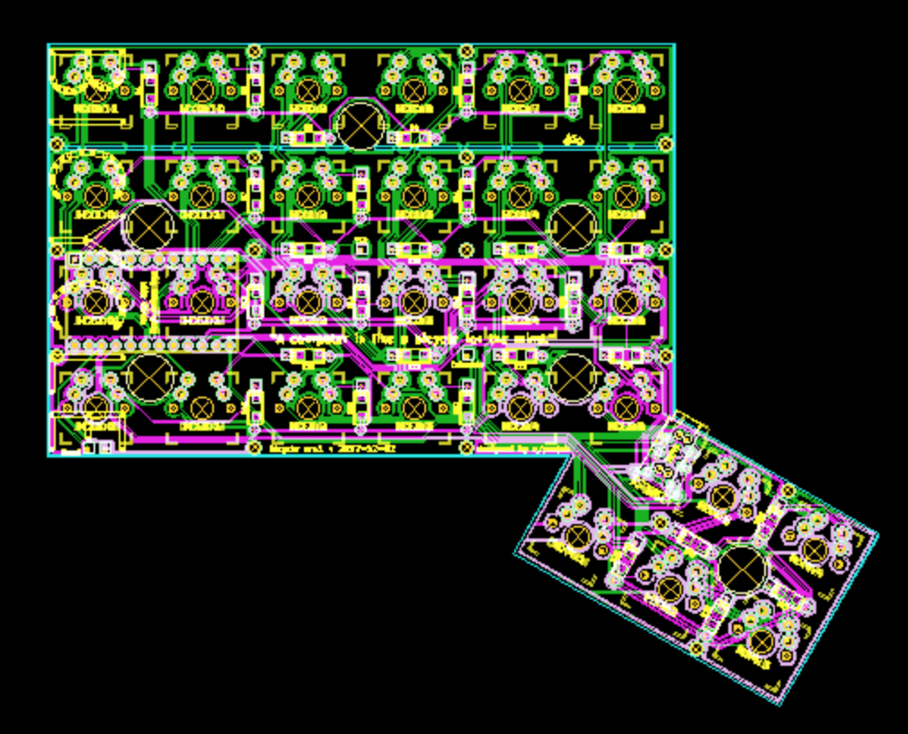

Bicycle is a 58 key ortholinear split keyboard PCB with a 5 key thumb cluster.

A more ergonomic version of the Let's Split keyboard, it adds an additional row to the matrix for use by a 30 degree angled thumb cluster of keys. Designed to be easy to build, it only supports serial communication over a TRRS cable and no LED support. The PCB is reversible, meaning that you need two of the same PCB to create a full keyboard.

Documentation is a work in progress.

# BOM

* 2 PCBs, Gerber files for printing can be found in the repo.
* 58 MX compatible switches.
* 58 1n4148 diodes.
* 2 Pro Micros.
* 2 PJ320A 3.5mm TRRS jacks.
* TRRS cable and micro USB cable.
